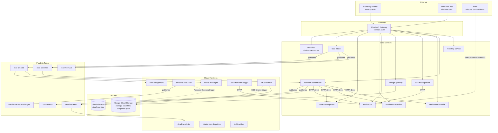
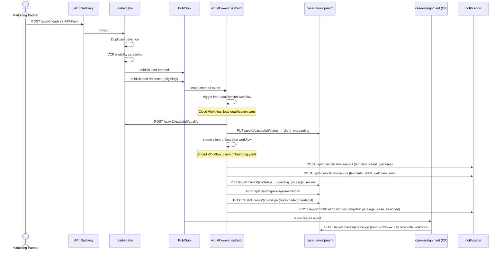
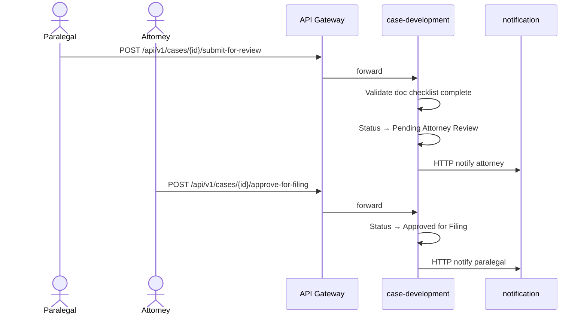
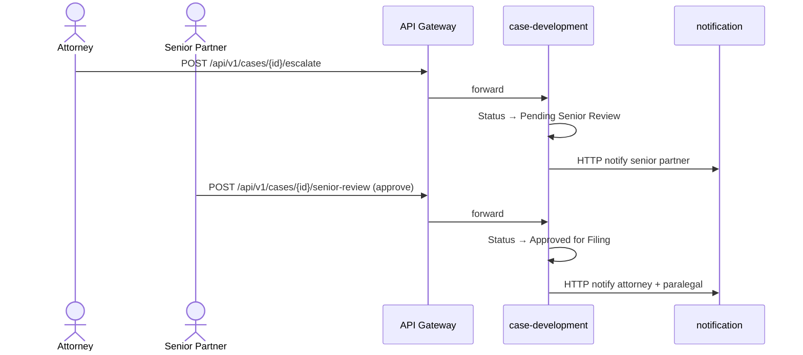
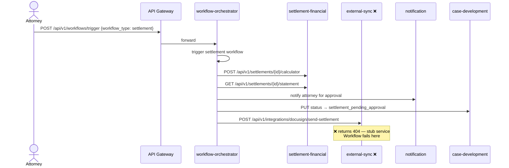

# ARCHITECTURE.md — SimpleTort System Design

> This is the single source of truth for system design. Any AI suggestion that contradicts this document must be rejected. Undocumented architectural decisions must be raised and recorded here before implementation begins.
>
> **Source of truth:** This document reflects the actual code in the repository, not design intent alone. Where the two diverge, the code governs and the divergence is flagged in the [Known Issues & Gaps](#known-issues--gaps) section.

---

## System Overview

SimpleTort is a microservices platform running on Google Cloud Run. Each service is a single Python 3.11 / FastAPI container deployed independently, except `auth-rbac` (Firebase Functions) and the skeleton services (Flask stubs).

**Communication patterns:**

| Pattern | Used for | Auth |
|---|---|---|
| Google Cloud Pub/Sub (async) | State change events, cross-service fan-out | N/A — topic-level IAM |
| Direct HTTPS (sync) | Requests requiring an immediate response; Cloud Workflow steps | OIDC service account tokens |
| Cloud Tasks HTTP (async) | Deferred/retryable work: notifications, reminders | OIDC token from Cloud Tasks |
| Twilio webhook (inbound) | SMS opt-out / STOP / HELP handling | Twilio request signature |

**File storage:** All GCS operations route exclusively through `storage-gateway`. No other service calls GCS directly.

**External traffic:** Enters via Google Cloud API Gateway (`openapi.yaml` at repo root). The gateway enforces Firebase JWT validation on all routes before traffic reaches any service.

**GCP project:** `simpletort-zadroga-dev` — `us-central1`

---

## Service Topology

---

## Service Map

| Service | Responsibility | Cloud Run URL | Publishes | Triggered by |
|---|---|---|---|---|
| `auth-rbac` | Firebase Auth, RBAC role management, JWT custom claims. Firebase Functions 2nd-gen backend (runs on Cloud Run). | `register-fn`, `password-reset-fn`, `create-session-fn` (separate Cloud Run services per function) | — | Firebase Auth events |
| `lead-intake` | Ingests leads from marketing partners (API key auth). Runs eligibility screening and duplicate detection. | `https://lead-intake-292736139819.us-central1.run.app` | `lead-created`, `lead-screened`, `lead-followup` | External partner API calls |
| `case-development` | Core case state machine. Manages the paralegal → attorney → senior partner approval chain. Dashboard and search. | `https://case-development-292736139819.us-central1.run.app` | — | Direct HTTP from API Gateway, Cloud Workflows |
| `enrollment-workflow` | VCF/WTC program enrollment, deadlines, timeline tracking. | `https://enrollment-workflow-292736139819.us-central1.run.app` | `enrollment-status-changes` (via pubsub_service.py) | Direct HTTP from API Gateway, Cloud Workflows |
| `notification` | Transactional email (SendGrid) and SMS (Twilio). Template-driven with opt-out enforcement and delivery tracking. | `https://notification-dev-292736139819.us-central1.run.app` | — | Direct HTTP from Cloud Workflows; Cloud Tasks HTTP handler; Twilio webhooks |
| `storage-gateway` | All GCS operations: upload, signed URLs, document metadata, lifecycle, audit logging. | `https://storage-gateway-dev-dev-292736139819.us-central1.run.app` ⚠️ | — | Direct HTTP from API Gateway and other services |
| `task-management` | Task creation, assignment, reminders via Cloud Tasks. | `https://task-management-292736139819.us-central1.run.app` | — | Direct HTTP from API Gateway |
| `settlement-financial` | Settlement calculator, fee config, expense tracking, lien management, PDF statement generation. | `https://settlement-financial-292736139819.us-central1.run.app` | — | Direct HTTP from API Gateway, Cloud Workflows |
| `workflow-orchestrator` | Triggers and manages Cloud Workflows. Handles cross-service orchestration. Manages workflow step config in Firestore. | `https://workflow-orchestrator-dev-292736139819.us-central1.run.app` | `case-events` (`workflow.triggered`, `workflow.completed`, `workflow.failed`, `task.created`, `task.completed`, `task.overdue`), `deadline-alerts` (`deadline.approaching`) | `lead-screened` Pub/Sub, direct HTTP from API Gateway |
| `reporting-service` | KPI aggregation, case/lead/staff metrics, dashboard data. | `https://reporting-service-292736139819.us-central1.run.app` | — | Direct HTTP from API Gateway |

> ⚠️ `storage-gateway` URL contains a double `-dev-dev-` segment — this is a known deploy misconfiguration. See [Known Issues](#known-issues--gaps).

---

## Pub/Sub Topics

| Topic | Publisher | Known subscribers |
|---|---|---|
| `lead-created` | `lead-intake` | `case-assignment` CF, `intake-drive-sync` CF |
| `lead-screened` | `lead-intake` | `workflow-orchestrator` (triggers `lead-qualification` workflow) |
| `lead-followup` | `lead-intake` | `notification` (sends follow-up SMS) |
| `case-events` | `workflow-orchestrator` | No known subscribers (consumed externally or intended for future use) |
| `deadline-alerts` | `workflow-orchestrator` | `deadline-alerter` CF |
| `enrollment-status-changes` | `deadline-calculator` CF | **No known subscribers** — see [Known Issues](#known-issues--gaps) |

---

## Cloud Workflows

All workflow definitions live in `services/workflow-orchestrator/cloud_workflows/`.

| Workflow | File | Purpose | Status |
|---|---|---|---|
| `lead-qualification` | `lead-qualification.yaml` | Runs VCF eligibility check, updates case status, triggers `client-onboarding` if qualified | **Live** — but contains hardcoded Cloud Run URLs (non-compliant, see ADR log) |
| `client-onboarding` | `client-onboarding.yaml` | Sends welcome communications, assigns paralegal (round-robin), sets case to `pending_paralegal_review`, triggers `vcf-enrollment` | **Live** |
| `vcf-enrollment` | `vcf-enrollment.yaml` | Checks WTC enrollment status, submits VCF registration, fetches deadlines, schedules 90-day deadline alerts | **Live** |
| `medical-processing` | `medical-processing.yaml` | Submits documents to `evidence-management` for Document AI OCR, polls for MedLM qualification score, routes to attorney review or manual review | **Blocked** — unconditional calls to `evidence-management` which is not yet built |
| `settlement` | `settlement.yaml` | Calculates settlement, generates PDF statement, sends settlement agreement via DocuSign, syncs to QuickBooks, disburses, closes case | **Blocked** — unconditional calls to `external-sync` for DocuSign and QuickBooks; `external-sync` is a stub and returns 404 on those paths |

---

## Cloud Functions

| Function | Trigger | Responsibility | Pub/Sub interaction |
|---|---|---|---|
| `case-assignment` | Pub/Sub: `lead-created` | Auto-assigns new cases to paralegals using workload-balanced round robin | Subscribes to `lead-created` |
| `deadline-alerter` | Cloud Scheduler | Scans cases for upcoming deadlines; fires alerts at 90, 30, and 7 days | Subscribes to `deadline-alerts` |
| `deadline-calculator` | Firestore Eventarc (`cases/{caseId}` written) | Recalculates enrollment filing deadline when `certificationDate` or `certificationStatus` changes. Rule: filing deadline = certificationDate + 2 years (configurable via `DEADLINE_YEARS`). | Publishes to `enrollment-status-changes` |
| `intake-drive-sync` | Pub/Sub: `lead-created` | Syncs lead intake documents to Google Drive | Subscribes to `lead-created` |
| `intake-form-dispatcher` | HTTP (POST `/send`) | Sends a Google Forms pre-fill intake link to the client via SendGrid. Generates a UUID token, writes to `intake_tokens/{tokenId}` in Firestore, advances case status `New Lead` → `Pending Client Info`. | — |
| `case-reminder-trigger` | Cloud Scheduler | Enqueues document reminder tasks via Cloud Tasks → calls `notification` HTTP endpoint | — |
| `virus-scanner` | GCS finalize event (Eventarc) | Runs ClamAV scan on uploaded file; updates document `scan_status` in Firestore | — |
| `build-notifier` | Cloud Build Pub/Sub (`cloud-builds` topic) | Posts build status (started, succeeded, failed, timed out, cancelled, awaiting approval) to Microsoft Teams via incoming webhook | Subscribes to `cloud-builds` |

---

## Data Flows

### 1. Lead submission → qualified → case created → assigned to paralegal

### 2. Paralegal submits → attorney approves → Approved for Filing

### 3. Attorney escalates → senior approves → Approved for Filing

### 4. Settlement workflow (currently blocked)

---

## Integration Points

| Integration | Purpose | Owned by | Status |
|---|---|---|---|
| Firebase Auth | Identity provider, JWT issuance, custom claim management | `auth-rbac` | Live |
| Google Cloud API Gateway | Entry point for all external traffic; enforces Firebase JWT | `openapi.yaml` (root) | Live |
| SendGrid | Transactional email delivery | `notification`, `intake-form-dispatcher` | Live |
| Twilio | SMS delivery + inbound opt-out handling | `notification` | Live |
| Google Drive | Document backup for lead intake docs | `intake-drive-sync` CF | Live |
| Google Forms | Pre-fill intake form links sent to clients | `intake-form-dispatcher` CF | Live |
| ClamAV | Virus scanning on all GCS uploads | `virus-scanner` CF | Live |
| DocuSign | Settlement agreement e-signature | `external-sync` → `settlement.yaml` | **Not built** — blocks settlement workflow |
| QuickBooks | Financial sync post-disbursement | `external-sync` → `settlement.yaml` | **Not built** — blocks settlement workflow |
| Microsoft Teams | CI/CD build status notifications | `build-notifier` CF | Live |

---

## Security Architecture

| Control | Implementation | Status |
|---|---|---|
| Encryption at rest | Firestore default AES-256; GCS default AES-256 | Live |
| Encryption in transit | TLS on all connections | Live |
| Inter-service auth | OIDC service account tokens — never plain HTTP | Live |
| External request auth | Firebase JWT enforced by API Gateway on all routes | Live |
| Partner API auth | `X-API-Key` header verified by `lead-intake` partner_auth middleware | Live |
| Database access rules | `services/auth-rbac/backend/firestore/firestore.rules` — gates all Firestore access | Live |
| File access | Signed URLs from `storage-gateway` required; no direct GCS access from other services | Live |
| Shared auth middleware | `shared/shared/middlewares/auth.py` — verifies Firebase JWT (via API Gateway header) and OIDC tokens (inter-service) | **Auth.py body is mostly commented out** — in progress, see [Known Issues](#known-issues--gaps) |
| File validation middleware | `shared/shared/middlewares/file_validation.py` | **Stub — pass-through only** |
| Signed URL expiry middleware | `shared/shared/middlewares/signed_url_expiry.py` | **Stub — pass-through only** |
| Audit logging | PHI access and case state changes logged with timestamp, user identity, action, document ID | Implemented in `services/storage-gateway/app/utils/audit.py` |
| Virus scanning | `virus-scanner` CF triggered on every GCS `finalize` event; document quarantined until `scan_status = clean` | Live |
| GCP CI/CD auth | GitHub Actions (`deploy.yml`) authenticates via **Workload Identity Federation** — no long-lived SA JSON key | Live — `GCP_SA_KEY` secret deleted from GitHub |

---

## Service Account Inventory

All service accounts follow the pattern `<role>@simpletort-zadroga-dev.iam.gserviceaccount.com`.

| Service Account | Used by | IAM Roles (minimum required) | Notes |
|---|---|---|---|
| `cloudbuild-sa@simpletort-zadroga-dev.iam.gserviceaccount.com` | Cloud Build (all services) | `roles/run.admin` — deploy Cloud Run services `roles/artifactregistry.writer` — push images `roles/iam.serviceAccountUser` — act as Cloud Run SA on deploy `roles/logging.logWriter` — Cloud Build logs | Default Cloud Build SA. No `roles/editor` or `roles/owner`. |
| `api-gateway-sa@simpletort-zadroga-dev.iam.gserviceaccount.com` | Cloud API Gateway backend auth | `roles/run.invoker` on each Cloud Run service | Impersonated by the gateway to call backend services. Set via `_GATEWAY_SA` substitution in `cloudbuild.gateway.yaml`. |
| `storage-gcs-sa@simpletort-zadroga-dev.iam.gserviceaccount.com` | `storage-gateway` Cloud Run service | `roles/storage.objectAdmin` on bucket `zadroga-case-files-simpletort-prod` `roles/datastore.user` — read/write Firestore `file_uploads` and `cases/*/documents` | Set via `_GCS_SA_EMAIL` substitution. Scoped to GCS + Firestore only — no other GCP APIs. |
| `virus-scanner-sa@simpletort-zadroga-dev.iam.gserviceaccount.com` | `virus-scanner` Cloud Run (CF Gen 2) | `roles/storage.objectAdmin` on bucket (move staging → final/quarantine) `roles/datastore.user` — update `file_uploads/{fileId}` scan status `roles/pubsub.publisher` — publish quarantine notifications `roles/eventarc.eventReceiver` — receive Eventarc GCS trigger | |
| `cloudrun-invoker-sa@simpletort-zadroga-dev.iam.gserviceaccount.com` | Cloud Tasks, Cloud Scheduler, Cloud Workflows | `roles/run.invoker` on target Cloud Run services | Bound per target service, not project-wide. Used by Cloud Tasks HTTP auth and Cloud Scheduler → `case-reminder-trigger`. |
| `github-wif-sa@simpletort-zadroga-dev.iam.gserviceaccount.com` | GitHub Actions (`deploy.yml`) via WIF | `roles/firebase.admin` — Firebase deploy for `auth-rbac` `roles/iam.serviceAccountTokenCreator` on itself (WIF impersonation) | Authenticated via Workload Identity Federation pool bound to `attribute.repository == "simpletort/Zadroga-Case-Management"`. No SA JSON key ever exported. |

### Principle of Least Privilege — Enforcement Rules

1. **No project-wide `roles/editor` or `roles/owner`** on any service account.
2. **Storage access is bucket-scoped**, not project-wide `roles/storage.admin`.
3. **Firestore access is `roles/datastore.user`** (read/write data), never `roles/datastore.owner`.
4. **Cloud Run invocation bindings are per-service**, not project-wide `roles/run.invoker`.
5. **WIF pool is repo-scoped** — `attribute.repository == "simpletort/Zadroga-Case-Management"` prevents other repos from impersonating the SA.
6. **No long-lived SA JSON keys** exist in any secret store. `GCP_SA_KEY` has been deleted from GitHub Secrets.

---

## What Is Not Yet Built

Services that are scaffolded (Flask hello-world stub) but have no real implementation. Do not reference, call, or depend on them:

| Service | Intended purpose | Deployment state |
|---|---|---|
| `evidence-management` | Document AI OCR + MedLM qualification scoring | Stub — has a live Cloud Run deployment but returns `Hello World` only |
| `external-sync` | DocuSign, QuickBooks, and external system integrations | Stub — has a live Cloud Run deployment; its paths return 404, which causes `settlement.yaml` to fail |
| `hipaa-compliance` | HIPAA controls and audit reporting | Stub |
| `vcf-claim-tracking` | VCF claim status tracking | Stub |
| `revenue-analytics` | Revenue reporting and forecasting | Stub |
| `reporting-kpi` | KPI reporting | Stub — **has a live Cloud Run URL registered in `openapi.yaml`** (`https://reporting-kpi-292736139819.us-central1.run.app`); routes through the gateway but serves no real endpoints |
| `counsel-substitution` | Attorney substitution workflow | Stub |
| `client-portal` | Client-facing portal | Stub (Flask) |

**Blocked workflows:**

| Workflow | Blocked by |
|---|---|
| `medical-processing` | `evidence-management` not built — workflow calls `/api/v1/documents/process` which returns 404 |
| `settlement` | `external-sync` not built — workflow calls DocuSign and QuickBooks paths which return 404 |

---

## Known Issues & Gaps

These are real discrepancies found between the code and the documented design. Each needs a resolution before it can be removed from this list.

| # | Location | Issue | Severity |
|---|---|---|---|
| 1 | `openapi.yaml` | `storage-gateway` backend URL contains double `-dev-dev-`: `https://storage-gateway-dev-dev-292736139819.us-central1.run.app` — likely a deploy misconfiguration | High — all storage gateway routes in the gateway may be broken |
| 2 | `shared/shared/middlewares/auth.py` | Middleware body is almost entirely commented out — in-progress implementation | High — auth enforcement depends on per-service implementations, not the shared layer |
| 3 | `shared/shared/middlewares/file_validation.py` | Pass-through stub — no actual file type or size validation occurs | Medium |
| 4 | `shared/shared/middlewares/signed_url_expiry.py` | Pass-through stub — no expiry enforcement at the middleware layer | Medium |
| 5 | `lead-qualification.yaml` | Hardcodes Cloud Run service URLs directly — violates the no-hardcode rule in `CLAUDE.md`. All other workflows use env-var-based URL construction. | Medium — see ADR log |
| 6 | `enrollment-status-changes` topic | Published by `deadline-calculator` CF; no known subscribers. If downstream consumers (e.g. `notification`, `enrollment-workflow`) are expected, subscriptions and handlers are missing. | Medium — silent data loss if event consumers are intended |
| 7 | `client-onboarding.yaml` + `case-assignment` CF | Both attempt to assign a paralegal to the same case — the workflow via `POST /cases/{id}/assign` and the CF on `lead-created`. Race condition if both fire. | Medium |
| 8 | `firestore/firestore.indexes.json` | Only contains indexes for the `notifications` collection. No composite indexes exist for `leads`, `cases`, `enrollments`, or any other collection. | Low — queries on those collections will either full-scan or fail at scale |
| 9 | `openapi.yaml` | `reporting-kpi` (`https://reporting-kpi-292736139819.us-central1.run.app`) is registered in the gateway but the service is a stub — any routed request returns an unexpected response | Low — skeleton service should not be in the gateway spec |
| 10 | `.github/workflows/deploy.yml` | Only covers `auth-rbac`. All other services rely on `cloudbuild.yaml` per-service. No unified CI view. | Low — operational visibility gap |
| ~~11~~ | ~~`deploy.yml`~~ | ~~Uses `GCP_SA_KEY` (service account JSON key) rather than Workload Identity Federation~~ | **Resolved** — WIF live, `GCP_SA_KEY` deleted from GitHub Secrets |

---

## Architectural Decision Log

| Date | Decision | Rationale |
|---|---|---|
| — | All file operations route through `storage-gateway` | Centralizes audit logging, virus scan enforcement, and signed URL lifecycle. Prevents GCS credential sprawl. |
| — | Inter-service calls use OIDC, not shared API keys | Service account tokens are short-lived, scoped, and auditable. API keys are long-lived secret sprawl. |
| — | Pub/Sub for cross-service state events, not direct HTTP | Decouples producers from consumers. `case-assignment`, `intake-drive-sync`, and `workflow-orchestrator` can evolve independently of `lead-intake`. |
| — | Firestore security rules live in `auth-rbac` | Single authoritative location for database access policy. Prevents rule drift across services. |
| — | Cloud Workflows for multi-step orchestration, not choreography | `lead-qualification`, `client-onboarding`, `vcf-enrollment` span 4+ services. Workflow YAML gives a readable, auditable step trace and handles retries. Pure Pub/Sub choreography would scatter the logic. |
| — | `notification` is HTTP-driven, not Pub/Sub-driven | Cloud Workflows calls `notification` directly mid-workflow to ensure delivery before the next step. Pub/Sub fan-out would make sequencing non-deterministic. Cloud Tasks handles retries for async notifications. |
| — | **NON-COMPLIANT: `lead-qualification.yaml` hardcodes Cloud Run URLs** | Hardcoded URLs for `lead-intake` and `case-development` exist in this workflow. This violates the no-hardcode rule. All other workflows use `sys.get_env("DEPLOY_ENV")` + `sys.get_env("CLOUD_RUN_SUFFIX")`. **Remediation required:** replace hardcoded URLs with the same env-var pattern used in the other four workflows before this workflow is used in any environment other than dev. |
