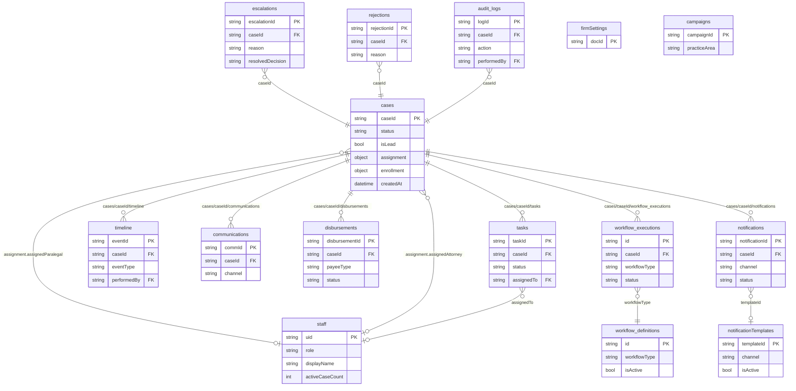

# DATA_MODEL.md — SimpleTort Firestore Data Model

> **Rule:** Every new Firestore collection must update `firestore/firestore.indexes.json` before the first write is merged. The index file is the authoritative source; Cloud Console is a read-only verification tool.
>
> **Source of truth:** This document reflects the actual code. Where design intent diverges from code, the divergence is called out with an ADR reference.

---

## PHI / PII Tiers

These tiers govern audit logging requirements. Apply them to every collection that carries this data.

| Tier | Definition | Logging requirement |
|---|---|---|
| **PHI** | Protected Health Information under HIPAA: medical conditions, diagnoses, health program enrollment status, certification dates, treatment history | Audit log on every **read and write** |
| **PII** | Personally Identifiable Information: name, email, phone, date of birth, address, SSN | Audit log on every **write**; read logging recommended |
| **Non-sensitive** | Case IDs, status values, timestamps, workflow state, staff UIDs | No audit requirement beyond standard application logs |

Fields marked `PHI` in the tables below require an audit log entry even for GET requests. Any service reading a PHI field from `cases` or any PHI-carrying subcollection must call the audit logger before returning the response.

---

## Entity Relationship Diagram

---

## Collections

### `cases`

**Owner:** `lead-intake` (creates document), `case-development` (manages status and sub-collections)
**Path:** `cases/{caseId}`

The central document in the system. Starts as a lead record (`isLead: true`) created by `lead-intake`. Transitions to an active case (`isLead: false`) when status advances past the lead lifecycle. The `enrollment` field is a sub-object stored directly on this document — it is **not** a separate top-level collection.

#### Core fields

| Field | Type | Required | PHI/PII | Description |
|---|---|---|---|---|
| `caseId` | `string` | ✓ | — | Format: `ZAD-YYYY-MM-NNNN` |
| `status` | `string` | ✓ | — | See case status machine in `AI_CONTEXT.md` |
| `vcfEligibility` | `string` | ✓ | — | `pending` \| `eligible` \| `ineligible` \| `needs_review` |
| `isLead` | `bool` | ✓ | — | `true` while in lead lifecycle; `false` once converted to active case |
| `createdAt` | `timestamp` | ✓ | — | |
| `updatedAt` | `timestamp` | ✓ | — | |
| `requestId` | `string` | ✓ | — | UUID of the intake request that created this document |

#### Claimant fields (PHI/PII — audit log every read and write)

| Field | Type | Required | PHI/PII | Description |
|---|---|---|---|---|
| `firstName` | `string` | ✓ | PII | |
| `lastName` | `string` | ✓ | PII | |
| `email` | `string` | ✓ | PII | Normalized to lowercase |
| `phone` | `string` | ✓ | PII | E.164 format |
| `dateOfBirth` | `string` (ISO date) | — | PHI | Optional at intake; required before filing |
| `address` | `object` | — | PII | `{street, city, state, zip}` |
| `exposureLocation` | `string` | ✓ | PHI | |
| `exposureDateStart` | `string` (ISO date) | ✓ | PHI | |
| `exposureDateEnd` | `string` (ISO date) | ✓ | PHI | |
| `wtcHealthProgramStatus` | `string` | ✓ | PHI | `enrolled` \| `applied` \| `not_applied` \| `unknown` |
| `conditions` | `string[]` | — | PHI | Claimed medical conditions matched against VCF covered categories |
| `priorAttorney` | `bool` | ✓ | PII | Whether client had prior representation |
| `vcfScreeningDetails` | `object` | — | PHI | Output from VCF screener — contains derived health eligibility data |

#### Source / partner fields

| Field | Type | Required | PHI/PII | Description |
|---|---|---|---|---|
| `marketingSource` | `string` | ✓ | — | |
| `referralCode` | `string` | — | — | |
| `partnerId` | `string` | ✓ | — | UID of the marketing partner who submitted the lead |

#### Assignment sub-object

| Field | Type | Required | PHI/PII | Description |
|---|---|---|---|---|
| `assignment.assignedParalegal` | `string` | — | — | Staff UID |
| `assignment.assignedAttorney` | `string` | — | — | Staff UID |
| `assignment.assignedAdmin` | `string` | — | — | Staff UID |
| `assignment.assignmentDate` | `timestamp` | — | — | |

#### Enrollment sub-object (canonical — see ADR-003)

Stored directly on the `cases` document as `enrollment.*`. Not a separate collection.

| Field | Type | Required | PHI/PII | Description |
|---|---|---|---|---|
| `enrollment.certificationStatus` | `string` | — | PHI | `Not Enrolled` \| `Application Pending` \| `Enrolled` \| `Already Enrolled` \| `Deceased` |
| `enrollment.certificationProgram` | `string` | — | — | Program identifier e.g. `wtc` |
| `enrollment.certificationDate` | `string` (ISO date) | — | PHI | Date program confirmed enrollment |
| `enrollment.certificationWorkflowStep` | `string` | — | — | Internal workflow step marker |
| `enrollment.certificationNotes` | `string` | — | — | |
| `enrollment.certificationUpdatedAt` | `timestamp` | — | — | |
| `enrollment.certificationUpdatedBy` | `string` | — | — | Staff UID |
| `enrollment.registrationStatus` | `string` | — | — | `Not Registered` \| `Registration Pending` \| `Registered` |
| `enrollment.registrationProgram` | `string` | — | — | Program identifier e.g. `vcf` |
| `enrollment.registrationNumber` | `string` | — | — | Claim/registration number once confirmed |
| `enrollment.filingDeadline` | `string` (ISO date) | — | — | `certificationDate` + 2 years |
| `enrollment.deadlineStatus` | `string` | — | — | `not_set` \| `active` \| `warning_90` \| `warning_60` \| `warning_30` \| `expired` |
| `enrollment.lastAlertMilestone` | `number` | — | — | Last alert fired: `90` \| `60` \| `30` \| `0` |
| `enrollment.registrationUpdatedAt` | `timestamp` | — | — | |
| `enrollment.registrationUpdatedBy` | `string` | — | — | Staff UID |

> **Frozen legacy fields (do not write, still present in prod documents pending migration — ADR-003):**
> `enrollment.wtcEnrollmentStatus`, `enrollment.wtcWorkflowStep`, `enrollment.wtcMemberId`,
> `enrollment.vcfRegistrationStatus`, `enrollment.vcfClaimNumber`, `enrollment.vcfFilingDeadline`

#### Workflow / lifecycle fields

| Field | Type | Required | PHI/PII | Description |
|---|---|---|---|---|
| `portalLoginAt` | `timestamp` | — | — | First client portal login |
| `followupTaskCreated` | `bool` | ✓ | — | Whether a follow-up task was created by the reminder trigger |
| `followupTaskId` | `string` | — | — | |
| `statusHistory` | `object[]` | ✓ | — | `[{status, timestamp, updatedBy, note}]` — append-only |

---

### `cases/{caseId}/tasks`

**Owner:** `task-management` (sole writer via API). `workflow-orchestrator` calls the `task-management` HTTP API — it never writes to this subcollection directly.
**Path:** `cases/{caseId}/tasks/{taskId}`

| Field | Type | Required | PHI/PII | Description |
|---|---|---|---|---|
| `taskId` | `string` | ✓ | — | UUID |
| `caseId` | `string` | ✓ | — | Parent case |
| `workflowExecutionId` | `string` | — | — | Links task to the workflow execution that created it |
| `title` | `string` | ✓ | — | |
| `description` | `string` | — | — | |
| `taskType` | `string` | ✓ | — | See `TaskType` enum in `task-management/app/models/task.py` |
| `status` | `string` | ✓ | — | `pending` \| `in_progress` \| `completed` \| `skipped` \| `overdue` |
| `priority` | `string` | ✓ | — | `low` \| `medium` \| `high` \| `critical` |
| `assignedTo` | `string` | — | — | Staff UID |
| `assignedToRole` | `string` | — | — | Role-based queue assignment |
| `dueAt` | `timestamp` | — | — | |
| `reminderSentAt` | `timestamp` | — | — | Set when `case-reminder-trigger` CF enqueues a reminder |
| `createdAt` | `timestamp` | ✓ | — | |
| `updatedAt` | `timestamp` | ✓ | — | |
| `completedAt` | `timestamp` | — | — | |
| `completedBy` | `string` | — | — | Staff UID |
| `completionNotes` | `string` | — | — | |
| `metadata` | `object` | — | — | Arbitrary workflow-specific payload |

**Valid status transitions:** `pending → in_progress, completed, skipped, overdue` | `in_progress → completed, skipped, overdue` | `overdue → in_progress, completed, skipped` | `completed` and `skipped` are terminal.

---

### `cases/{caseId}/timeline`

**Owner:** `case-development`
**Path:** `cases/{caseId}/timeline/{eventId}`

No Pydantic document model yet — **model required** (see ADR-007).

| Field | Type | Required | PHI/PII | Description |
|---|---|---|---|---|
| `eventId` | `string` | ✓ | — | Auto-generated |
| `caseId` | `string` | ✓ | — | |
| `eventType` | `string` | ✓ | — | e.g. `assignment_changed`, `status_changed`, `note_added` |
| `performedBy` | `string` | ✓ | — | Staff UID or `system` |
| `performedByRole` | `string` | — | — | |
| `description` | `string` | ✓ | — | Human-readable summary |
| `metadata` | `object` | — | — | Event-specific payload |
| `createdAt` | `timestamp` | ✓ | — | |

---

### `cases/{caseId}/communications`

**Owner:** `case-development`
**Path:** `cases/{caseId}/communications/{commId}`

| Field | Type | Required | PHI/PII | Description |
|---|---|---|---|---|
| `commId` | `string` | ✓ | — | UUID |
| `channel` | `string` | ✓ | — | `Email` \| `Call` \| `Letter` \| `Fax` \| `In Person` |
| `direction` | `string` | ✓ | — | `Inbound` \| `Outbound` |
| `subject` | `string` | ✓ | — | |
| `body` | `string` | — | PHI | May contain health-related content |
| `from` | `string` | — | PII | Sender address |
| `to` | `string` | — | PII | Recipient address |
| `deliveryStatus` | `string` | — | — | `Sent` \| `Failed` \| `Pending` |
| `isAutomated` | `bool` | ✓ | — | |
| `loggedBy` | `string` | — | — | Staff UID for manually logged entries |
| `templateId` | `string` | — | — | FK → `notificationTemplates` |
| `externalMessageId` | `string` | — | — | SendGrid/Twilio message ID |
| `sentAt` | `timestamp` | — | — | |

---

### `cases/{caseId}/notifications`

**Owner:** `notification` (dual-write — also written to top-level `notifications`)
**Path:** `cases/{caseId}/notifications/{notificationId}`

Same schema as top-level `notifications`. See below.

---

### `cases/{caseId}/workflow_executions`

**Owner:** `workflow-orchestrator` (dual-write — also written to top-level `workflow_executions`)
**Path:** `cases/{caseId}/workflow_executions/{executionId}`

Same schema as top-level `workflow_executions`. See below.

---

### `cases/{caseId}/settlement`

**Owner:** `settlement-financial`
**Path:** `cases/{caseId}/settlement` — **single document** (not a subcollection)

> **ADR-005:** The canonical design is one settlement document per case. Current code in `settlement-financial` uses `.collection("settlement")` which treats it as a subcollection — this is a bug. The fix is to use `.document("settlement")` directly on the case. Tracked in ADR-005.

| Field | Type | Required | PHI/PII | Description |
|---|---|---|---|---|
| `caseId` | `string` | ✓ | — | |
| `grossAward` | `string` (Decimal) | — | — | USD amount as decimal string |
| `attorneyFeePct` | `string` (Decimal) | — | — | |
| `feeOverride` | `object` | — | — | Per-case override of firm default fee config |
| `expenses` | `object[]` | — | — | Embedded expense items (see `Expense` model) |
| `liens` | `object[]` | — | — | Embedded lien items (see `Lien` model) |
| `loans` | `object[]` | — | — | Embedded loan items (see `Loan` model) |
| `notes` | `string` | — | — | |
| `updatedAt` | `timestamp` | — | — | |
| `updatedBy` | `string` | — | — | Staff UID |

---

### `cases/{caseId}/disbursements`

**Owner:** `settlement-financial`
**Path:** `cases/{caseId}/disbursements/{disbursementId}`

| Field | Type | Required | PHI/PII | Description |
|---|---|---|---|---|
| `disbursementId` | `string` | ✓ | — | UUID |
| `caseId` | `string` | ✓ | — | |
| `payee` | `string` | ✓ | PII | Payee name |
| `payeeType` | `string` | ✓ | — | `Client` \| `Lienholder` \| `Lender` \| `Firm` |
| `amount` | `string` (Decimal) | ✓ | — | USD |
| `date` | `timestamp` | ✓ | — | |
| `method` | `string` | — | — | `Check` \| `Wire` \| `ACH` |
| `referenceNumber` | `string` | — | — | |
| `status` | `string` | ✓ | — | `Pending` \| `Paid` \| `Cleared` |
| `qbPaymentId` | `string` | — | — | QuickBooks payment ID (set when `external-sync` is built) |
| `qbSyncStatus` | `string` | — | — | `Pending` \| `Synced` \| `Error` |
| `processedBy` | `string` | ✓ | — | Staff UID |
| `processedAt` | `timestamp` | ✓ | — | |

---

### `staff`

**Owner:** `auth-rbac` (creates/manages via Admin SDK). Read by `case-development`, `task-management`.
**Path:** `staff/{uid}`

No Pydantic document model found — **model required** (see ADR-007).

| Field | Type | Required | PHI/PII | Description |
|---|---|---|---|---|
| `uid` | `string` | ✓ | — | Firebase Auth UID (document ID) |
| `displayName` | `string` | ✓ | — | |
| `email` | `string` | ✓ | PII | |
| `role` | `string` | ✓ | — | `senior_partner` \| `junior_partner` \| `paralegal` \| `admin_staff` \| `system_admin` |
| `isActive` | `bool` | ✓ | — | Inactive staff are excluded from assignment pools |
| `activeCaseCount` | `number` | ✓ | — | Maintained by `case-development` for workload balancing |
| `maxCaseload` | `number` | — | — | Optional cap; enforced by assignment logic |
| `createdAt` | `timestamp` | ✓ | — | |
| `updatedAt` | `timestamp` | ✓ | — | |

---

### `roles`

**Owner:** `auth-rbac` (Admin SDK only — no client writes)
**Path:** `roles/{roleId}`

| Field | Type | Required | PHI/PII | Description |
|---|---|---|---|---|
| `roleId` | `string` | ✓ | — | e.g. `paralegal`, `junior_partner` (document ID) |
| `permissions` | `string[]` | ✓ | — | Array of permission keys e.g. `["cases.read", "cases.write"]` |
| `displayName` | `string` | ✓ | — | Human-readable role name |

---

### `notifications`

**Owner:** `notification` (dual-write — also at `cases/{caseId}/notifications/{notificationId}`)
**Path:** `notifications/{notificationId}`

| Field | Type | Required | PHI/PII | Description |
|---|---|---|---|---|
| `notificationId` | `string` | ✓ | — | UUID (document ID in both collections) |
| `caseId` | `string` | ✓ | — | FK → `cases` |
| `recipientId` | `string` | — | — | Staff or client UID |
| `channel` | `string` | ✓ | — | `SMS` \| `Email` |
| `templateId` | `string` | ✓ | — | FK → `notificationTemplates` |
| `status` | `string` | ✓ | — | `queued` \| `sent` \| `delivered` \| `failed` \| `bounced` |
| `providerMessageId` | `string` | — | — | SendGrid/Twilio message ID |
| `deliveredAt` | `timestamp` | — | — | |
| `errorMessage` | `string` | — | — | |
| `retryCount` | `number` | ✓ | — | |
| `createdAt` | `timestamp` | ✓ | — | |

---

### `notificationTemplates`

**Owner:** `notification`
**Path:** `notificationTemplates/{templateId}`

> **Canonical name is `notificationTemplates`.** The `sms_templates_collection` config variable in `template_service.py` must be removed — the collection name is not configurable (see ADR-008).

| Field | Type | Required | PHI/PII | Description |
|---|---|---|---|---|
| `templateId` | `string` | ✓ | — | e.g. `welcome_sms`, `paralegal_case_assigned` (document ID) |
| `name` | `string` | ✓ | — | Human-readable label |
| `body` | `string` | ✓ | — | SMS body with `{{variable}}` placeholders |
| `subject` | `string` | — | — | Email subject line |
| `htmlBody` | `string` | — | — | HTML email body; auto-derived from `body` when absent |
| `isActive` | `bool` | ✓ | — | `false` = template disabled; dispatch refused |
| `channel` | `string` | ✓ | — | `SMS` \| `Email` \| `Both` |
| `triggerEvent` | `string` | — | — | e.g. `new_lead_created` |
| `createdAt` | `timestamp` | ✓ | — | |
| `updatedAt` | `timestamp` | ✓ | — | |

---

### `escalations`

**Owner:** `case-development`
**Path:** `escalations/{escalationId}`

No Pydantic document model — **model required** (ADR-007).

| Field | Type | Required | PHI/PII | Description |
|---|---|---|---|---|
| `escalationId` | `string` | ✓ | — | UUID |
| `caseId` | `string` | ✓ | — | FK → `cases` |
| `reason` | `string` | ✓ | — | `high_value_claim` \| `unusual_medical_condition` \| `prior_attorney_conflict` \| `other` |
| `notes` | `string` | — | — | Required when reason is `other` |
| `escalatedBy` | `string` | ✓ | — | Attorney's staff UID |
| `escalatedByName` | `string` | — | — | |
| `originalAttorneyId` | `string` | — | — | |
| `status` | `string` | ✓ | — | `pending` \| `resolved` |
| `resolvedDecision` | `string` | — | — | `approve` \| `reject` \| `return_to_paralegal` |
| `resolvedAt` | `timestamp` | — | — | |
| `resolvedBy` | `string` | — | — | Senior partner's staff UID |
| `escalatedAt` | `timestamp` | ✓ | — | |

---

### `escalation_events`

**Owner:** `case-development`
**Path:** `escalation_events/{eventId}`

Audit trail for individual escalation state transitions. Separate from `escalations` (which holds the current state). No Pydantic document model — **model required** (ADR-007).

| Field | Type | Required | PHI/PII | Description |
|---|---|---|---|---|
| `eventId` | `string` | ✓ | — | UUID |
| `escalationId` | `string` | ✓ | — | FK → `escalations` |
| `caseId` | `string` | ✓ | — | FK → `cases` |
| `eventType` | `string` | ✓ | — | e.g. `escalated`, `decided`, `returned` |
| `performedBy` | `string` | ✓ | — | Staff UID |
| `performedByRole` | `string` | ✓ | — | |
| `previousStatus` | `string` | ✓ | — | |
| `newStatus` | `string` | ✓ | — | |
| `notes` | `string` | — | — | |
| `createdAt` | `timestamp` | ✓ | — | |

---

### `rejections`

**Owner:** `case-development`
**Path:** `rejections/{rejectionId}`

No Pydantic document model — **model required** (ADR-007).

| Field | Type | Required | PHI/PII | Description |
|---|---|---|---|---|
| `rejectionId` | `string` | ✓ | — | UUID |
| `caseId` | `string` | ✓ | — | FK → `cases` |
| `reason` | `string` | ✓ | — | `insufficient_medical_evidence` \| `does_not_meet_vcf_criteria` \| `incomplete_documentation` \| `client_unresponsive` \| `other` |
| `notes` | `string` | — | — | Required when reason is `other` |
| `rejectedBy` | `string` | ✓ | — | Attorney's staff UID |
| `rejectedAt` | `timestamp` | ✓ | — | |
| `reinstatedAt` | `timestamp` | — | — | Set if case is later reinstated |
| `reinstatedBy` | `string` | — | — | Staff UID |

---

### `audit_logs`

**Owner:** `storage-gateway`, cloud functions — all PHI audit entries write here via Admin SDK.
**Path:** `audit_logs/{logId}`

> **Canonical collection name is `audit_logs`.** The `audit_events` collection written by `case-development` is deprecated — see ADR-004. All new audit writes must use `audit_logs`. A migration script is required to copy `audit_events` into `audit_logs`.

| Field | Type | Required | PHI/PII | Description |
|---|---|---|---|---|
| `logId` | `string` | ✓ | — | UUID |
| `caseId` | `string` | — | — | Present for all case-scoped events |
| `action` | `string` | ✓ | — | e.g. `phi_read`, `case_status_changed`, `document_uploaded` |
| `resourceType` | `string` | ✓ | — | e.g. `cases`, `documents` |
| `resourceId` | `string` | ✓ | — | Document ID of the accessed resource |
| `performedBy` | `string` | ✓ | — | Staff UID or `system` |
| `performedByRole` | `string` | ✓ | — | |
| `fieldsAccessed` | `string[]` | — | — | PHI fields read in a GET request |
| `previousValue` | `object` | — | — | Redacted snapshot before a write |
| `newValue` | `object` | — | — | Redacted snapshot after a write |
| `ipAddress` | `string` | — | — | |
| `userAgent` | `string` | — | — | |
| `timestamp` | `timestamp` | ✓ | — | |

---

### `workflow_executions`

**Owner:** `workflow-orchestrator` (dual-write — also at `cases/{caseId}/workflow_executions/{id}`)
**Path:** `workflow_executions/{executionId}`

| Field | Type | Required | PHI/PII | Description |
|---|---|---|---|---|
| `id` | `string` | ✓ | — | UUID |
| `caseId` | `string` | ✓ | — | FK → `cases` |
| `workflowType` | `string` | ✓ | — | e.g. `lead-qualification`, `client-onboarding` |
| `status` | `string` | ✓ | — | `pending` \| `running` \| `completed` \| `failed` |
| `arguments` | `object` | — | — | Input arguments passed to the Cloud Workflow |
| `result` | `object` | — | — | Output from Cloud Workflow on completion |
| `error` | `string` | — | — | Error message on failure |
| `gcpExecutionName` | `string` | — | — | Full GCP Cloud Workflows execution resource name |
| `createdAt` | `timestamp` | ✓ | — | |
| `updatedAt` | `timestamp` | ✓ | — | |
| `completedAt` | `timestamp` | — | — | |

---

### `workflow_definitions`

**Owner:** `workflow-orchestrator`
**Path:** `workflow_definitions/{workflowId}`

Stores configurable step parameters for each Cloud Workflow. Step configs (thresholds, timeouts, fee percentages) are read by Cloud Workflows at execution time via the orchestrator's `/internal/workflow-step-config/{workflowId}` endpoint.

No Pydantic document model — **model required** (ADR-007).

| Field | Type | Required | PHI/PII | Description |
|---|---|---|---|---|
| `id` | `string` | ✓ | — | Workflow name e.g. `lead-qualification` (document ID) |
| `name` | `string` | ✓ | — | Human-readable |
| `isActive` | `bool` | ✓ | — | Inactive definitions are not triggerable |
| `stepParameters` | `object` | — | — | Keyed by step name; values are step-specific config objects |
| `createdAt` | `timestamp` | ✓ | — | |
| `updatedAt` | `timestamp` | ✓ | — | |

---

### `firmSettings`

**Owner:** `auth-rbac` / `settlement-financial`
**Path:** `firmSettings/{docId}`

Document IDs are fixed identifiers. Currently known documents:

| Document ID | Purpose |
|---|---|
| `fee_config` | Firm-wide attorney fee configuration (see `FeeConfig` model in `settlement-financial/models/fee_config.py`) |

The `fee_config` document schema includes `feeStructureType` (`flat` \| `graduated`), `flatPercentage`, `graduatedTiers[]`, `feeCap`, and `updatedBy`.

---

### `documents`

**Owner:** `storage-gateway`
**Path:** `documents/{fileId}`

| Field | Type | Required | PHI/PII | Description |
|---|---|---|---|---|
| `fileId` | `string` | ✓ | — | UUID |
| `caseId` | `string` | ✓ | — | FK → `cases` |
| `fileName` | `string` | ✓ | — | Original file name |
| `category` | `string` | ✓ | — | `medical_records` \| `proof_of_presence` \| `id_documents` \| `legal_forms` \| `vcf_documents` \| `settlement_docs` \| `client_uploads` \| `temp_lead_attachments` |
| `gcsPath` | `string` | — | — | Permanent GCS path — `null` until clean virus scan completes |
| `mimeType` | `string` | — | — | |
| `sizeBytes` | `number` | — | — | |
| `uploadedBy` | `string` | — | — | Staff UID |
| `uploadedAt` | `timestamp` | — | — | |
| `processingStatus` | `string` | ✓ | — | `Pending` \| `Processing` \| `Completed` \| `Failed` |
| `verificationStatus` | `string` | ✓ | — | `Unverified` \| `AI Verified` \| `Manually Verified` \| `Rejected` |
| `scanStatus` | `string` | ✓ | — | `pending` \| `scanning` \| `clean` \| `infected` \| `error` |
| `extractedData` | `object` | — | PHI | Structured data extracted by Document AI pipeline |
| `documentAiResults` | `object` | — | PHI | Raw Document AI output |
| `medicalAiResults` | `object` | — | PHI | MedLM output (once evidence-management is built) |
| `isOnHold` | `bool` | — | — | Lifecycle-hold flag — prevents deletion |

---

### `file_uploads`

**Owner:** `storage-gateway`
**Path:** `file_uploads/{fileId}`

Staging record created when a signed URL is issued. Updated by the `virus-scanner` CF when scan completes.

No Pydantic document model — **model required** (ADR-007).

| Field | Type | Required | PHI/PII | Description |
|---|---|---|---|---|
| `fileId` | `string` | ✓ | — | UUID (matches `documents/{fileId}` once promoted) |
| `caseId` | `string` | ✓ | — | |
| `fileName` | `string` | ✓ | — | |
| `folderPath` | `string` | ✓ | — | Destination path relative to `caseId` |
| `stagingPath` | `string` | ✓ | — | GCS staging path where signed URL points |
| `finalPath` | `string` | — | — | Permanent path; set after clean scan |
| `quarantinePath` | `string` | — | — | Set if virus detected |
| `scanStatus` | `string` | ✓ | — | `pending` \| `scanning` \| `clean` \| `infected` \| `error` |
| `isQuarantined` | `bool` | ✓ | — | |
| `scanCompletedAt` | `timestamp` | — | — | |
| `registeredAt` | `timestamp` | ✓ | — | |

---

### `searchPresets`

**Owner:** `case-development`
**Path:** `searchPresets/{presetId}`

Saved filter presets per staff member. No Pydantic document model — **model required** (ADR-007).

| Field | Type | Required | PHI/PII | Description |
|---|---|---|---|---|
| `presetId` | `string` | ✓ | — | UUID |
| `ownerId` | `string` | ✓ | — | Staff UID who saved this preset |
| `name` | `string` | ✓ | — | |
| `filters` | `object` | ✓ | — | Serialized `FilterPresetFilters` object |
| `createdAt` | `timestamp` | ✓ | — | |
| `updatedAt` | `timestamp` | ✓ | — | |

---

### `intake_tokens`

**Owner:** `intake-form-dispatcher` CF
**Path:** `intake_tokens/{tokenId}`

Short-lived tokens for Google Forms pre-fill intake links. No Pydantic document model — **model required** (ADR-007).

| Field | Type | Required | PHI/PII | Description |
|---|---|---|---|---|
| `tokenId` | `string` | ✓ | — | UUID v4 (document ID) |
| `caseId` | `string` | ✓ | — | FK → `cases` |
| `emailSent` | `bool` | ✓ | — | Whether the intake link was successfully emailed |
| `previewUrl` | `string` | ✓ | — | Google Forms pre-fill URL |
| `expiresAt` | `timestamp` | ✓ | — | Default: creation + 30 days (`TOKEN_EXPIRY_DAYS`) |
| `createdAt` | `timestamp` | ✓ | — | |

---

### `config`

**Owner:** `intake-form-dispatcher` CF (reads only — written via Firebase Console or admin script)
**Path:** `config/{docId}`

| Document ID | Purpose |
|---|---|
| `intake_form` | Google Forms field mapping: `formBaseUrl` + `fieldMappings` dict of `{fieldName: entry.XXXXXXXXXX}` |

---

### `campaigns`

**Owner:** `lead-intake` (future)
**Path:** `campaigns/{campaignId}`

> **Not yet built.** This collection is a first-class entity described in `AI_CONTEXT.md` but has no code implementation. See ADR-006 for interim state and ownership.

Intended schema (to be finalized when built):

| Field | Type | Required | PHI/PII | Description |
|---|---|---|---|---|
| `campaignId` | `string` | ✓ | — | |
| `name` | `string` | ✓ | — | e.g. `Zadroga`, `Camp Lejeune` |
| `practiceArea` | `string` | ✓ | — | Always `mass_tort` |
| `eligibilityRuleset` | `object` | ✓ | — | Admin-configurable exposure dates, diagnosis codes, geographic criteria |
| `documentRequirements` | `string[]` | ✓ | — | Required document checklist |
| `filingDeadlineConfig` | `object` | ✓ | — | Default deadline rules for this campaign |
| `feeConfig` | `object` | — | — | Campaign-level fee override (inherits from `firmSettings/fee_config` if absent) |
| `isActive` | `bool` | ✓ | — | |
| `createdAt` | `timestamp` | ✓ | — | |
| `updatedAt` | `timestamp` | ✓ | — | |

---

### Internal collections (Admin SDK only — no service code reads these)

| Collection | Purpose |
|---|---|
| `_sessions` | Server-side session store |
| `_rate_limits` | Rate limiter state |
| `_portal_invites` | Client portal invitation tokens |
| `analyticsCache` | Pre-aggregated analytics snapshots |
| `complianceMetrics` | Compliance reporting metrics |
| `integrationConfig` | External integration configuration |
| `integrationSync` | Integration sync state |

---

### Deprecated collections

| Collection | Deprecated by | ADR | Action required |
|---|---|---|---|
| `audit_events` | `audit_logs` | ADR-004 | Migration script required: copy all `audit_events` documents into `audit_logs`, then remove `audit_events` writes from `case-development` |

---

## Relationships

| Relationship | Type | Notes |
|---|---|---|
| `cases` → `cases/{caseId}/tasks` | 1:many subcollection | Written by `task-management` only |
| `cases` → `cases/{caseId}/timeline` | 1:many subcollection | Append-only; written by `case-development` |
| `cases` → `cases/{caseId}/communications` | 1:many subcollection | Written by `case-development` |
| `cases` → `cases/{caseId}/notifications` | 1:many subcollection | Dual-written by `notification` |
| `cases` → `cases/{caseId}/workflow_executions` | 1:many subcollection | Dual-written by `workflow-orchestrator` |
| `cases` → `cases/{caseId}/disbursements` | 1:many subcollection | Written by `settlement-financial` |
| `cases` → `cases/{caseId}/settlement` | 1:1 document | Written by `settlement-financial`; see ADR-005 re: subcollection bug |
| `cases.assignment.assignedParalegal` → `staff.uid` | reference | Not enforced by Firestore; enforced in `case-development` assignment logic |
| `cases.assignment.assignedAttorney` → `staff.uid` | reference | Same |
| `escalations.caseId` → `cases.caseId` | reference | |
| `escalation_events.escalationId` → `escalations.escalationId` | reference | |
| `rejections.caseId` → `cases.caseId` | reference | |
| `notifications.templateId` → `notificationTemplates.templateId` | reference | |
| `workflow_executions.workflowType` → `workflow_definitions.id` | reference | Soft reference — no Firestore enforcement |
| `tasks.workflowExecutionId` → `workflow_executions.id` | reference | |
| `audit_logs.caseId` → `cases.caseId` | reference | |

---

## Index Requirements

All indexes must be defined in `firestore/firestore.indexes.json`. The `services/lead-intake/firestore.indexes.json` file **must be merged into the root file** and the per-service file deleted (ADR-009).

### Currently defined indexes

**`notifications` collection** (in `firestore/firestore.indexes.json`):

| Fields | Scope |
|---|---|
| `caseId ASC, createdAt DESC` | COLLECTION |
| `status ASC, createdAt DESC` | COLLECTION |
| `channel ASC, status ASC, createdAt DESC` | COLLECTION |
| `caseId ASC, channel ASC, createdAt DESC` | COLLECTION |
| `caseId ASC, status ASC, createdAt DESC` | COLLECTION |
| `templateId ASC, status ASC, createdAt DESC` | COLLECTION |
| `retryCount ASC, status ASC, createdAt DESC` | COLLECTION |

**`cases` collection** (currently in `services/lead-intake/firestore.indexes.json` — must be merged):

| Fields | Scope |
|---|---|
| `status ASC, followupTaskCreated ASC, createdAt ASC` | COLLECTION |
| `status ASC, createdAt DESC` | COLLECTION |
| `vcfEligibility ASC, createdAt DESC` | COLLECTION |
| `email ASC, createdAt DESC` | COLLECTION |
| `marketingSource ASC, createdAt DESC` | COLLECTION |
| `email ASC, phone ASC` | COLLECTION |

### Missing indexes (must be added — ADR-009)

| Collection | Fields | Needed by | Scope |
|---|---|---|---|
| `tasks` (subcollection) | `status IN [...], due_date ASC` | `workflow-orchestrator` collection-group query | COLLECTION_GROUP |
| `tasks` (subcollection) | `assigned_to ASC, status IN [...]` | `workflow-orchestrator` list active tasks | COLLECTION_GROUP |
| `tasks` (subcollection) | `assigned_to_role ASC, status IN [...]` | `workflow-orchestrator` role queue | COLLECTION_GROUP |
| `workflow_executions` | `caseId ASC, status ASC, createdAt DESC` | `workflow-orchestrator` case-scoped queries | COLLECTION |
| `escalations` | `caseId ASC, status ASC` | `case-development` | COLLECTION |
| `audit_logs` | `caseId ASC, timestamp DESC` | All PHI audit reads | COLLECTION |
| `audit_logs` | `performedBy ASC, timestamp DESC` | Compliance reporting | COLLECTION |

---

## Architectural Decision Records

### ADR-003 — Enrollment model migration
**Decision:** `certification_models.py` and `registration_models.py` are the canonical enrollment models going forward. `wtc_models.py` and `vcf_models.py` are frozen — no new writes using their schemas.
**State:** Old field names (`enrollment.wtcEnrollmentStatus`, `enrollment.vcfClaimNumber`, etc.) are still present in live Firestore documents. A migration script must read all `cases` documents and rename the old fields to the new canonical names.
**Owner:** enrollment-workflow team.

### ADR-004 — Audit collection consolidation
**Decision:** Canonical audit collection is `audit_logs`. The `audit_events` collection written by `case-development` is deprecated.
**Action:** (1) Update `case-development` to write to `audit_logs`. (2) Run migration script to copy `audit_events` → `audit_logs`. (3) Delete `audit_events` writes.
**Owner:** case-development team.

### ADR-005 — Settlement document shape
**Decision:** `cases/{caseId}/settlement` is a single document, not a subcollection. The `.collection("settlement")` call in `settlement-financial` is a bug.
**Action:** Replace with `.document("settlement")` accessed directly from the case document reference.
**Owner:** settlement-financial team.

### ADR-006 — Campaigns collection
**Decision:** `campaigns` is a first-class Firestore collection owned by `lead-intake`. It is not yet built. Until it is, campaign configuration is managed out-of-band. No service should attempt to read from `campaigns` until the collection and its model are implemented.
**Owner:** lead-intake team.

### ADR-007 — Missing Pydantic document models
**Decision:** The following collections lack Pydantic document models (as opposed to request/response models). Each must have a document model before the next feature touching that collection is merged.
**Priority order:** `escalations`, `escalation_events`, `rejections`, `timeline`, `file_uploads`, `workflow_definitions`, `searchPresets`, `intake_tokens`.
**Owner:** owning service team per collection.

### ADR-008 — `notificationTemplates` collection name
**Decision:** The canonical Firestore collection name is `notificationTemplates`. The configurable `sms_templates_collection` setting in `notification/services/template_service.py` must be removed and the collection name hardcoded.
**Owner:** notification team.

### ADR-009 — Index file consolidation
**Decision:** All Firestore indexes must be defined in the single root `firestore/firestore.indexes.json`. The `services/lead-intake/firestore.indexes.json` file must be merged into the root file and deleted. Missing indexes listed above must be added.
**Action:** Export current indexes from Cloud Console, diff against the index file, resolve discrepancies, and merge.
**Owner:** Platform / lead-intake team.
